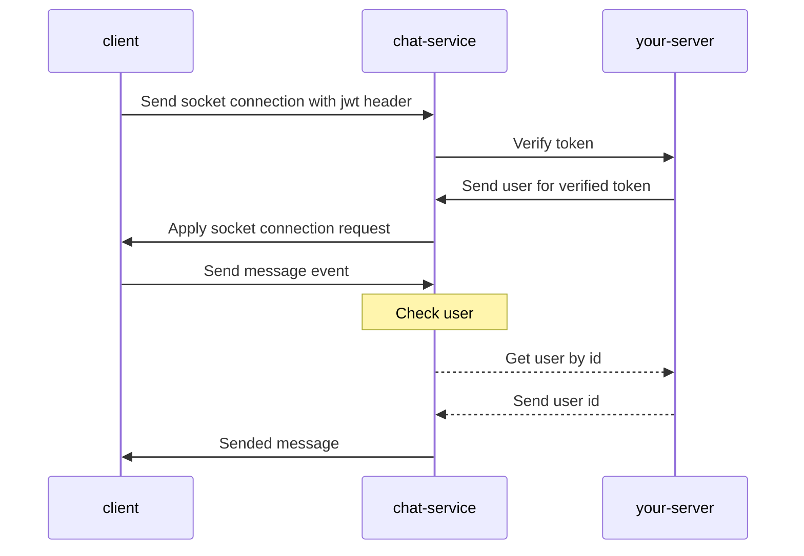

# Chat Service

This repository for provide real time chat service to your own projects. You can use quickly with configure to the .env file like as sample.env file.

## How is it work?

You should make a some endpoints for authentication. First of all, we need to user and user/:id endpoint. This endpoints should returns to user id in a json object. This service make a request to your server with key from .env id with X-Key header name. Example response for these endpoints:

`{id: "<user id>"}`

## Diagram

## DTO Types

### For Message Event

Connect to chat namespace and send json like:

`{"content": "text", "to": "<user id>"}`

### For Error Events

Listen to "error" events on socket.

### For Last Conversations

`/api/conversation?page=1&limit=10`

You can change page and limit parameters. This used for pagination. This returns message list for last messages of conversations.

### For Chat History

`/api/message/<user id>?page=1&limit=10`

You can change page and limit parameters. This used for pagination. This returns message list between you and user.

#### Feel free to open an issue
